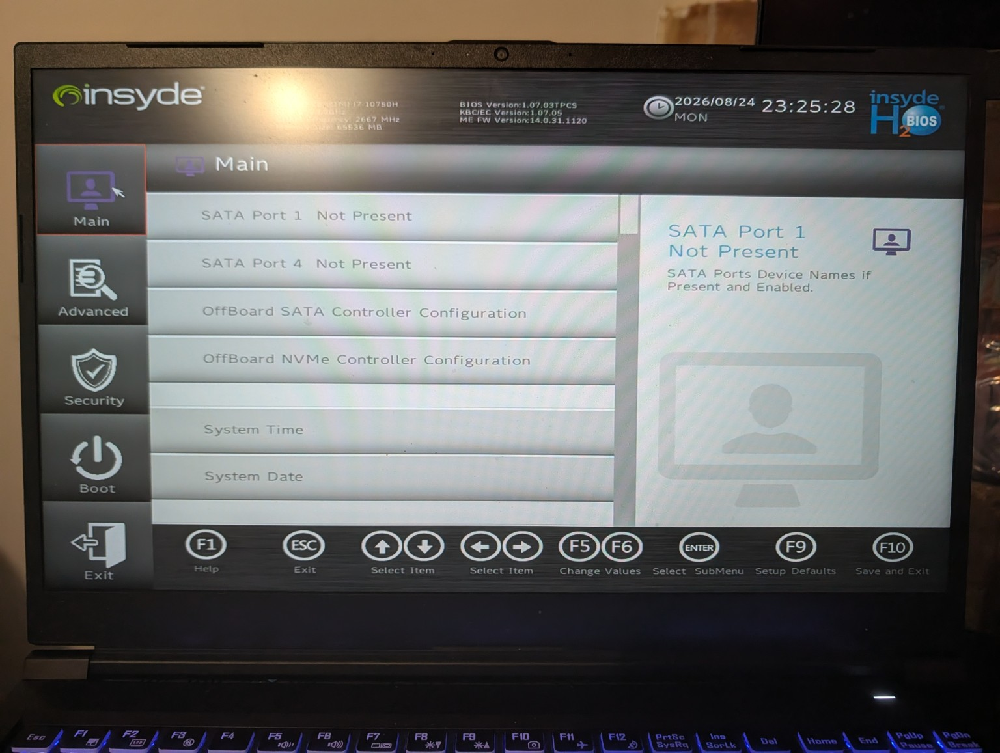
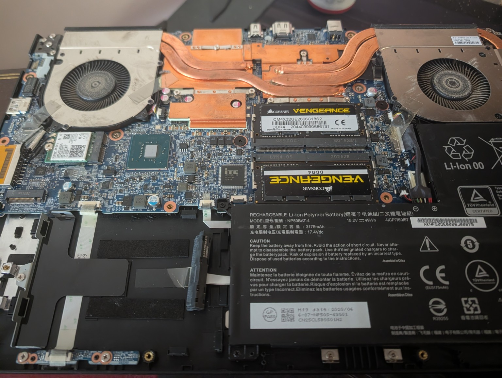
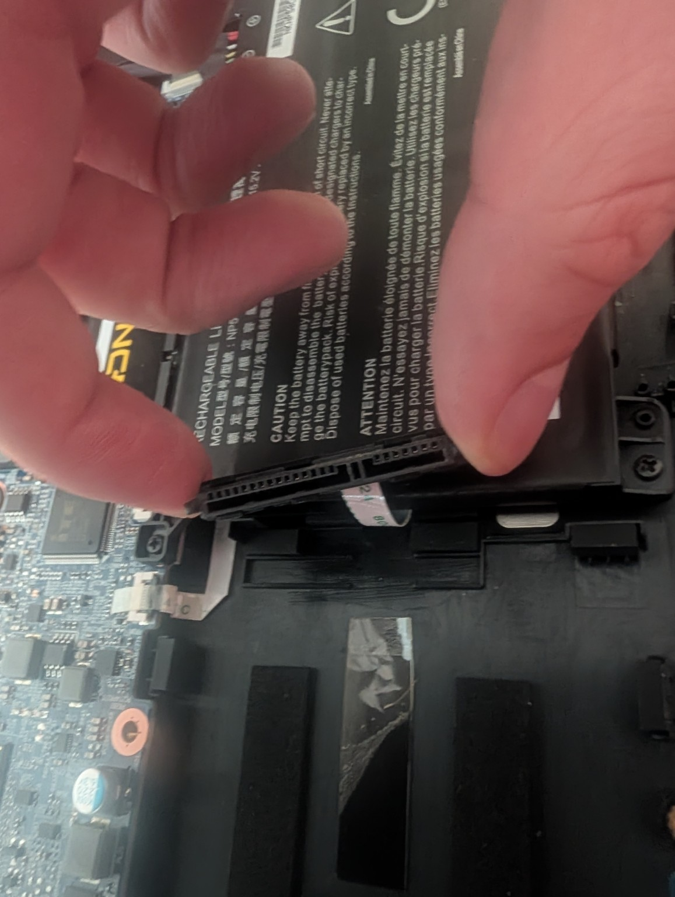
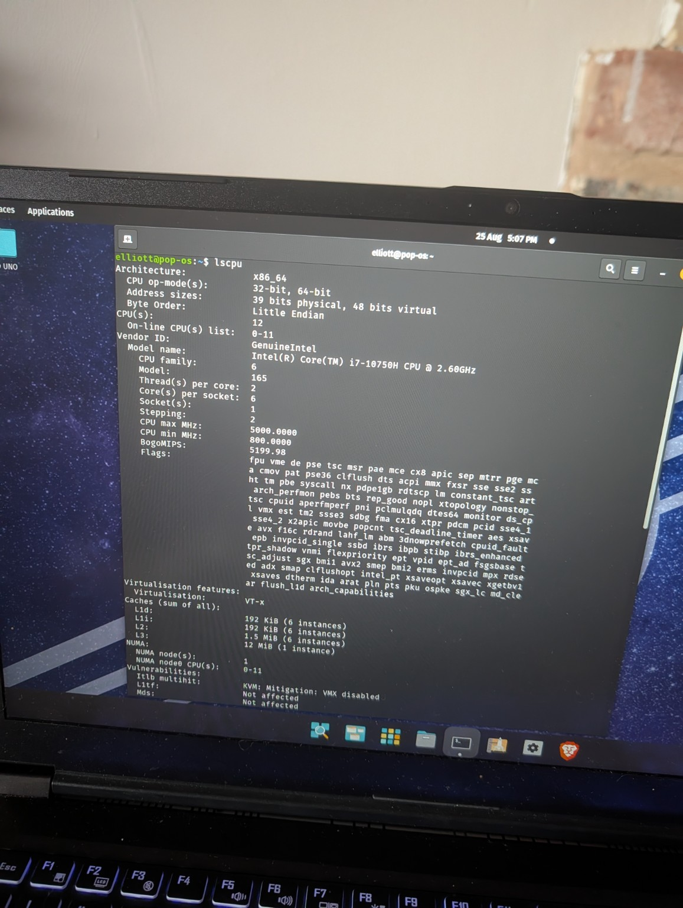
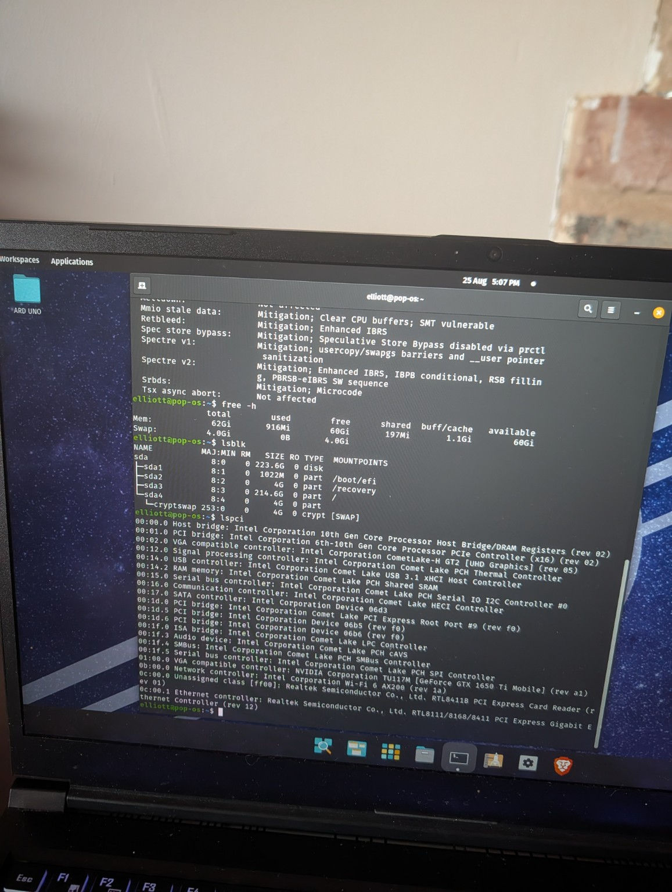
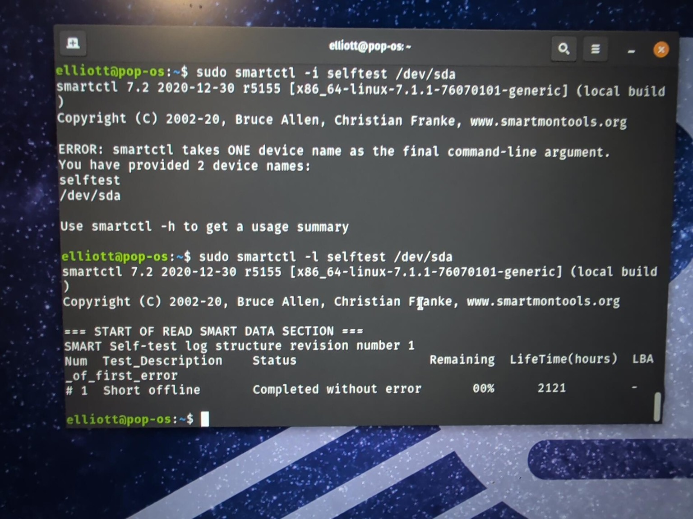

# Initial System Assessment

## Project Background

This project involves repurposing an old gaming laptop into a headless Linux home lab server.

When the laptop was last regularly used, the internal display was experiencing problems and was believed to be faulty. During the initial assessment for this project, however, the internal display successfully produced a clear image without any immediately obvious visual defects. The condition and reliability of the display therefore remain under investigation.

Regardless of the display's condition, the long-term goal is to configure the laptop as a headless server. Once configured and tested, the server will normally remain powered on and be administered remotely across the local network from another computer. The laptop's display and HDMI output will remain available as backup methods for direct troubleshooting if remote access is unavailable.

## Stage 1 Initial Power-On Test

The laptop successfully powered on during the initial assessment.

During the initial boot test, the system did not boot into an operating system. Instead, it attempted an EFI PXE network boot over IPv6, which failed.


*Figure 1 - Initial boot attempt showing the system falling back to an EFI PXE network boot after failing to locate a usable local boot device.*

## Initial Observations

The PXE boot attempt suggests that the system did not locate a usable local boot device before attempting to boot from the network.

At this stage, possible causes include:

- No operating system installed
- Missing or damaged bootloader
- Internal storage not being detected
- Failed internal storage
- Internal storage having previously been removed

No conclusion has been reached yet.

## Next Diagnostic Step

The next step will be to inspect the BIOS/UEFI configuration and determine whether the internal storage device is detected before physically opening the laptop.


## Stage 2 - BIOS and Storage Diagnostics

Following the initial PXE boot failure, further diagnostics were performed to determine why the laptop could not locate a bootable operating system and whether an internal storage device was being detected.

### Boot Device Check

After restarting the laptop, the system displayed a message stating that the default boot device was missing or that the boot process had failed.

The Boot Option Menu was inspected and contained no available bootable devices.

This confirmed that the system could not locate a bootable device. However, this alone did not confirm whether an internal storage device was physically installed, as a blank, failed, disconnected, or otherwise undetected drive could potentially produce similar symptoms.

The BIOS/UEFI configuration was therefore inspected.

### BIOS/UEFI Inspection

The InsydeH2O BIOS Setup Utility was accessed using the F2 key during startup.

The BIOS reported the following system information:

- CPU: Intel Core i7-10750H @ 2.60 GHz
- Installed memory: 65,536 MB (64 GB)
- SATA mode: AHCI

The Main section of the BIOS was inspected for detected storage devices.

The following SATA ports were reported as:

- SATA Port 1: Not Present
- SATA Port 4: Not Present



*Figure 2 - BIOS/UEFI Main screen showing no storage devices detected on SATA Port 1 or SATA Port 4.*


The OffBoard SATA Controller Configuration and OffBoard NVMe Controller Configuration were also inspected.

No storage devices were reported as present in either configuration.

### Current Diagnostic Conclusion

The BIOS/UEFI is currently detecting no SATA or NVMe storage devices.

This is consistent with the previous observations:

- The laptop failed to boot from local storage.
- The system fell back to an EFI PXE network boot attempt.
- The PXE boot attempt failed.
- A "Default Boot Device Missing or Boot Failed" message was displayed.
- The Boot Option Menu contained no bootable devices.
- No SATA storage devices were detected by the BIOS.
- No NVMe storage devices were detected by the BIOS.

At this stage, there are two primary possibilities:

1. The laptop's previous internal storage device has been physically removed.
2. A storage device remains installed but is not being detected due to a connection, hardware, or device failure.

A physical inspection is required before reaching a final conclusion.

### Troubleshooting Process

The investigation was deliberately performed from the least invasive diagnostic steps before moving to physical hardware inspection.

The troubleshooting process so far has been:

PXE boot failure  
→ Check Boot Option Menu  
→ No bootable devices found  
→ Enter BIOS/UEFI  
→ Check SATA storage  
→ No SATA devices detected  
→ Check NVMe storage  
→ No NVMe devices detected  
→ Physical inspection required

### Next Step - Physical Hardware Inspection

The next stage of the initial assessment will involve opening the laptop and inspecting the internal hardware.

Before opening the laptop, the system will be completely powered down and disconnected from external power and peripherals.

The inspection will determine:

- Whether an internal SSD or HDD is physically installed
- Whether any installed storage device is correctly connected
- Which SATA and/or M.2 storage interfaces are available
- Whether there are any obvious hardware or connection problems
- What type of replacement storage would be required if no drive is installed

No replacement storage will be purchased until the laptop's internal storage configuration has been physically confirmed.

## Stage 3 - Physical Hardware Inspection and Test Drive Verification

Following the BIOS and storage diagnostics, the laptop was physically inspected to determine whether an internal storage device was installed and whether the available storage interfaces appeared usable.

### Physical Inspection

The laptop was completely powered down and disconnected from external power and peripherals before the bottom cover was removed.

A visual inspection of the internal hardware confirmed that no storage device was installed in the available internal storage locations.

The inspection identified:

- An empty 2.5-inch SATA storage bay
- SATA data and power connection hardware present
- No installed M.2/NVMe SSD
- Two Corsair Vengeance DDR4 memory modules
- Dual cooling fans and heatpipe assembly
- No obvious signs of major physical damage
- Only minor visible dust accumulation

The SATA connector and associated cabling were visually inspected and showed no obvious signs of damage.



*Figure 3 - Internal view of the laptop showing the motherboard, cooling system, 64 GB DDR4 memory and empty internal storage locations.*

A closer inspection of the 2.5-inch SATA connection confirmed that the combined SATA data and power connector was present.



*Figure 4 - Close-up of the empty 2.5-inch SATA storage connection. The connector and cabling showed no obvious signs of physical damage.*

### Known-Good SATA SSD Test

Before purchasing replacement storage, a spare Kingston 240 GB 2.5-inch SATA SSD was used to test the laptop's storage interface.

The spare SSD was physically compatible with the laptop's SATA connection and storage bay.

The SSD contained an existing Pop!_OS Linux installation.

After installing the SSD, the laptop initially displayed a boot failure before subsequently locating the drive and successfully booting into Pop!_OS.

This demonstrated that the laptop was capable of:

- Detecting the SATA SSD
- Reading data from the drive
- Loading an existing bootloader
- Starting a Linux operating system
- Reaching a functioning desktop environment

This strongly supports the conclusion that the original boot problem was caused by the absence of an internal storage device rather than a failed SATA controller or motherboard fault.

### Linux Hardware Verification

The existing Pop!_OS installation was then used as a temporary diagnostic environment.

Several standard Linux commands were used to verify that the operating system could correctly detect the main hardware components.

#### CPU Verification

The `lscpu` command reported:

- Architecture: x86_64
- CPU: Intel Core i7-10750H @ 2.60 GHz
- 6 physical CPU cores
- 12 logical processors/threads
- Intel VT-x virtualisation support

The presence of VT-x is particularly useful for the planned homelab because the server will later be used to host virtual machines.



*Figure 5 - Linux `lscpu` output confirming the Intel Core i7-10750H, 6-core/12-thread configuration and VT-x virtualisation support.*

#### Memory Verification

The `free -h` command reported approximately 62 GiB of usable system memory.

This is consistent with the 64 GB of installed DDR4 memory identified during the physical inspection and in the BIOS.

#### Storage Verification

The `lsblk` command detected the temporary Kingston SSD as:

- Device: `sda`
- Usable capacity: approximately 223.6 GiB

The drive contained an existing Pop!_OS installation with EFI, recovery, root and encrypted swap partitions.

This further confirmed that the SATA storage connection was functioning correctly.

#### PCI Hardware Verification

The `lspci` command successfully enumerated several major system devices, including:

- Intel chipset and PCI controllers
- Intel Wi-Fi 6 AX200 wireless adapter
- Realtek PCIe Gigabit Ethernet controller
- NVIDIA GeForce GTX 1650 Ti Mobile GPU
- USB controllers
- Audio devices
- Other PCI-connected system hardware



*Figure 6 - Linux hardware verification showing memory, storage and PCI device detection using `free -h`, `lsblk` and `lspci`.*

### Diagnostic Conclusion

Stage 3 confirmed that the laptop's core hardware is functioning sufficiently to continue with the homelab project.

The investigation established that:

- The laptop originally contained no internal storage device.
- The SATA storage bay and connector are present.
- The SATA interface successfully detects and boots from a known-good SSD.
- The motherboard, CPU and memory are functioning sufficiently to run Linux.
- Approximately 64 GB of RAM is available.
- The Intel Core i7-10750H provides 6 cores and 12 threads.
- Intel VT-x virtualisation support is available.
- Gigabit Ethernet and Wi-Fi hardware are detected.
- The NVIDIA GPU is detected.
- No major hardware fault has been identified during the initial assessment.

The original EFI PXE boot failure can therefore be explained by the absence of an installed local storage device. With no bootable local drive available, the firmware fell back to attempting a network boot.

### Next Steps

Before replacing the existing Pop!_OS installation, a small number of additional health checks will be performed, including storage health and system temperature checks.

Provided those checks do not identify any significant problems, the temporary 240 GB SATA SSD will be used to continue the project.

A larger SATA SSD may be installed later when additional storage capacity is required.


## Stage 4 - Operating System Update and SSD Health Validation

Following the successful installation and boot of the temporary Kingston 240 GB SATA SSD, additional checks were performed before proceeding with the server installation.

The purpose of this stage was to ensure that the existing Pop!_OS installation was sufficiently up to date for further diagnostic work and to assess the health and reliability of the temporary SSD.

### Operating System Update

The existing Pop!_OS installation on the SSD had not been used or updated for approximately one year.

Before relying on the operating system for further hardware diagnostics, the installed software and packages were updated.

During the upgrade process, `dpkg` reported errors involving the following System76 DKMS packages:

- `system76-dkms`
- `system76-acpi-dkms`

The incomplete package configuration was investigated using:

```bash
sudo dpkg --configure -a
```

The resulting output showed that the System76 DKMS modules were encountering errors while attempting to build against an installed Linux kernel.

DKMS (Dynamic Kernel Module Support) is used to automatically rebuild third-party kernel modules when Linux kernels are installed or updated. This allows modules such as hardware drivers to remain compatible following kernel updates.

To determine which Linux kernel was currently running, the following command was used:

```bash
uname -r
```

Before rebooting, the system reported:

```text
6.0.2-76060002-generic
```

The software update had installed a newer Linux kernel, but the operating system was still running the older kernel already loaded into memory.

The laptop was therefore rebooted and the kernel version checked again.

Following the reboot, `uname -r` returned:

```text
7.1.1-76070101-generic
```

This confirmed that the laptop successfully booted using the newly installed Linux kernel.

Although the system successfully booted into the newer kernel, the earlier System76 DKMS package errors were noted rather than treated as fully resolved, as successful booting alone does not confirm that both packages subsequently configured without error.

### Installing SMART Diagnostic Tools

With the updated Pop!_OS environment successfully booting, the next step was to assess the health of the temporary Kingston 240 GB SATA SSD.

The `smartmontools` package was installed using:

```bash
sudo apt install smartmontools
```

This package provides the `smartctl` utility, which can retrieve SMART (Self-Monitoring, Analysis and Reporting Technology) information recorded internally by compatible storage devices.

The SSD's SMART information was retrieved using:

```bash
sudo smartctl -a /dev/sda
```

The overall SMART health assessment reported:

```text
PASSED
```

The overall PASS result was not treated as sufficient evidence by itself. Additional SMART attributes and the drive's recorded history were reviewed for possible signs of wear, communication problems or storage failure.

### SMART Health Results

The SMART information showed the following notable results:

- Overall SMART health assessment: **PASSED**
- Power-on time: approximately **2,121 hours**
- Power cycle count: approximately **2,279**
- Operating temperature: approximately **32°C**
- Reported uncorrectable errors: **0**
- Reallocated events observed: **0**
- SATA physical/communication errors observed: **0**
- SSD life indicator: approximately **96%**
- SMART error log: **No Errors Logged**
- Unsafe shutdown count: **17**

The historical unsafe shutdown count was noted. However, the remaining SMART information did not indicate a current storage fault.

The drive showed a high remaining life indicator, no significant error history and no evidence of communication problems with the laptop's SATA interface.

### SMART Short Self-Test

In addition to reviewing the SSD's recorded SMART information, the drive's built-in short self-test was performed.

The test was started using:

```bash
sudo smartctl -t short /dev/sda
```

The SSD reported that the test would require approximately two minutes to complete.

After allowing the test to finish, the SMART self-test log was retrieved using:

```bash
sudo smartctl -l selftest /dev/sda
```

The result was:

```text
# 1  Short offline  Completed without error  00%  2121  -
```

The `00%` value represents the percentage of the test remaining and therefore indicates that the diagnostic completed fully.

The key result was:

```text
Completed without error
```

This confirmed that the SSD successfully completed its internal short diagnostic without identifying an error.



*Figure 7 - SMART short self-test result for the temporary Kingston 240 GB SATA SSD, confirming that the diagnostic completed without error.*

### Stage 4 Diagnostic Conclusion

The temporary Kingston 240 GB SATA SSD successfully passed both its SMART health assessment and its built-in short self-test.

The assessment established that:

- The SSD passes its overall SMART health assessment.
- The SMART short self-test completed without error.
- No reported uncorrectable errors were identified.
- No significant reallocation activity was identified.
- No SATA communication errors were identified.
- No errors were recorded in the SMART error log.
- The drive operated at a normal temperature during testing.
- The SSD reported approximately 96% remaining life.
- The laptop successfully boots and operates using the updated Linux kernel.

No significant evidence of an active SSD fault was identified.

The temporary Kingston 240 GB SATA SSD is therefore considered suitable for continued use during the initial homelab server build.

The primary limitation of the drive is its capacity rather than its current health. The 240 GB SSD is sufficient for the initial server installation and early homelab work, but additional storage may eventually be required as the environment expands to include virtual machines, containers, snapshots, backups and other services.

### Next Steps

With the temporary SSD validated, the remaining initial hardware checks will focus on system stability and functionality, including:

- System temperature monitoring
- Network interface testing
- Basic stability testing

Once these checks are complete and no significant hardware problems have been identified, the initial system assessment can be concluded and the project can proceed to installation and configuration of the server operating system.
