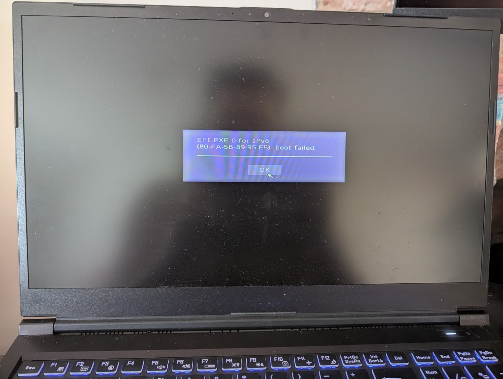

# Initial System Assessment

## Project Background

This project involves repurposing an old gaming laptop into a headless Linux home lab server.

When the laptop was last regularly used, the internal display was experiencing problems and was believed to be faulty. During the initial assessment for this project, however, the internal display successfully produced a clear image without any immediately obvious visual defects. The condition and reliability of the display therefore remain under investigation.

Regardless of the display's condition, the long-term goal is to configure the laptop as a headless server. Once configured and tested, the server will normally remain powered on and be administered remotely across the local network from another computer. The laptop's display and HDMI output will remain available as backup methods for direct troubleshooting if remote access is unavailable.

## Initial Power-On Test

The laptop successfully powered on during the initial assessment.

During the initial boot test, the system did not boot into an operating system. Instead, it attempted an EFI PXE network boot over IPv6, which failed.

## Initial Observations

The PXE boot attempt suggests that the system did not locate a usable local boot device before attempting to boot from the network.

At this stage, possible causes include:

- No operating system installed
- Missing or damaged bootloader
- Internal storage not being detected
- Failed internal storage
- Internal storage having previously been removed

No conclusion has been reached yet.

## Next Diagnostic Step

The next step will be to inspect the BIOS/UEFI configuration and determine whether the internal storage device is detected before physically opening the laptop.
