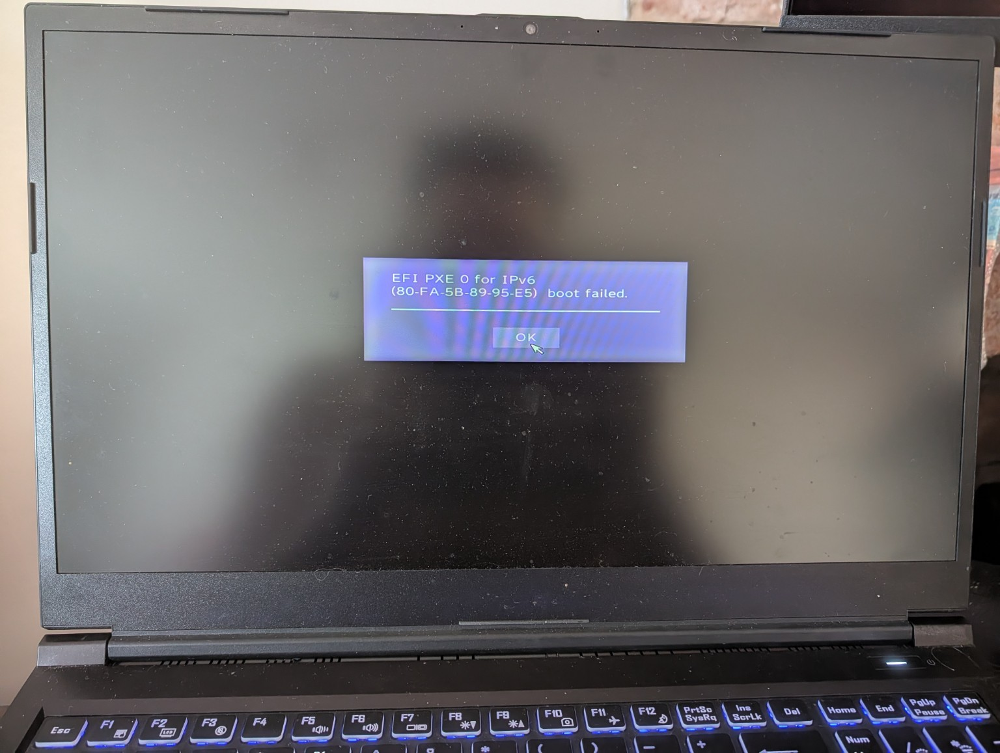
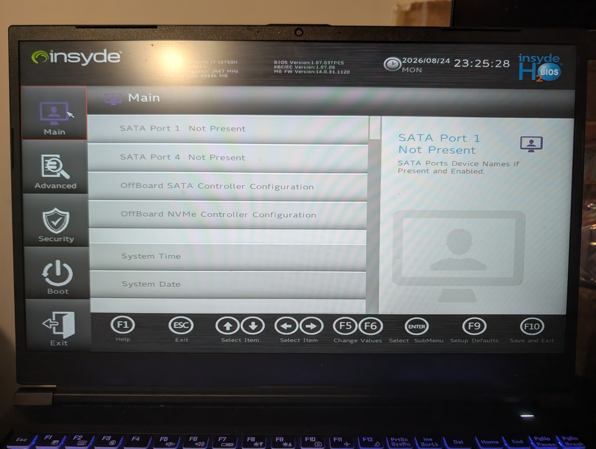
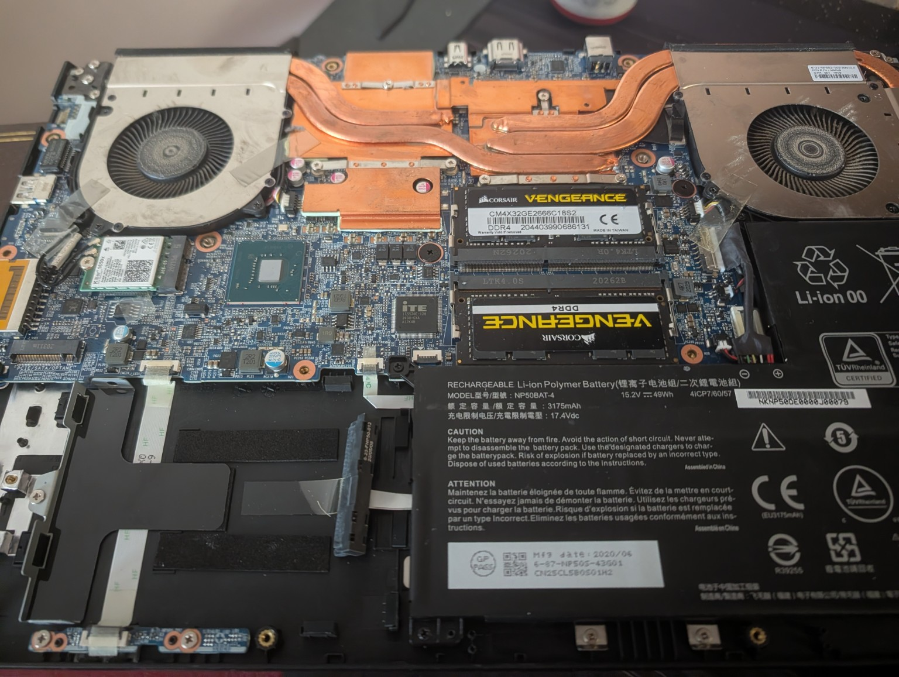
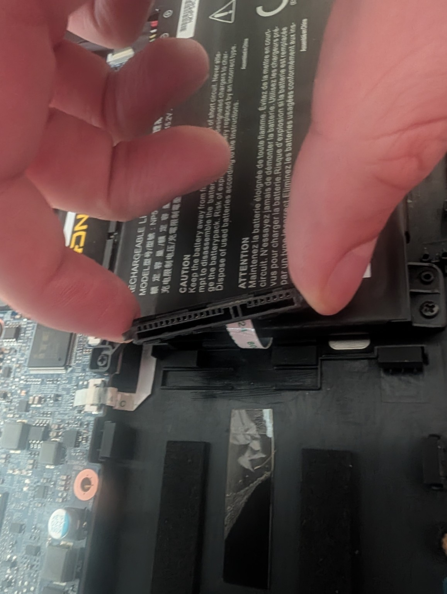
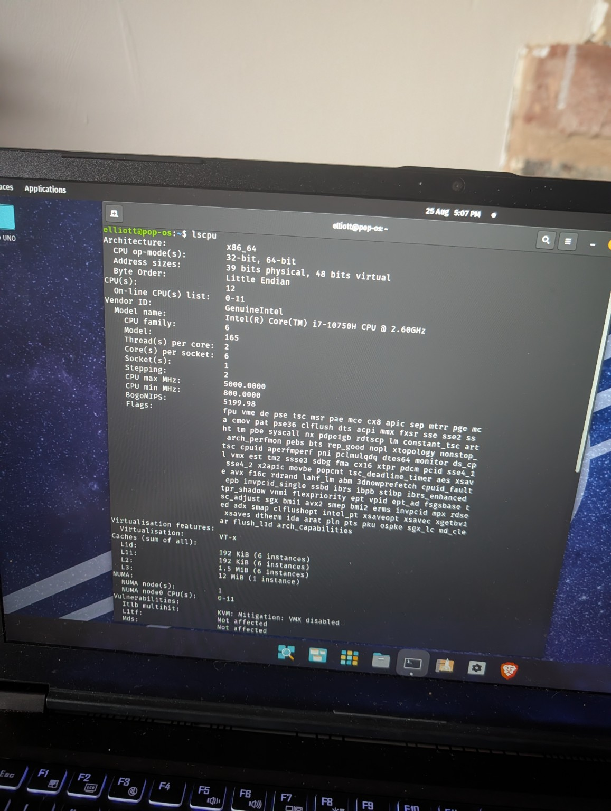
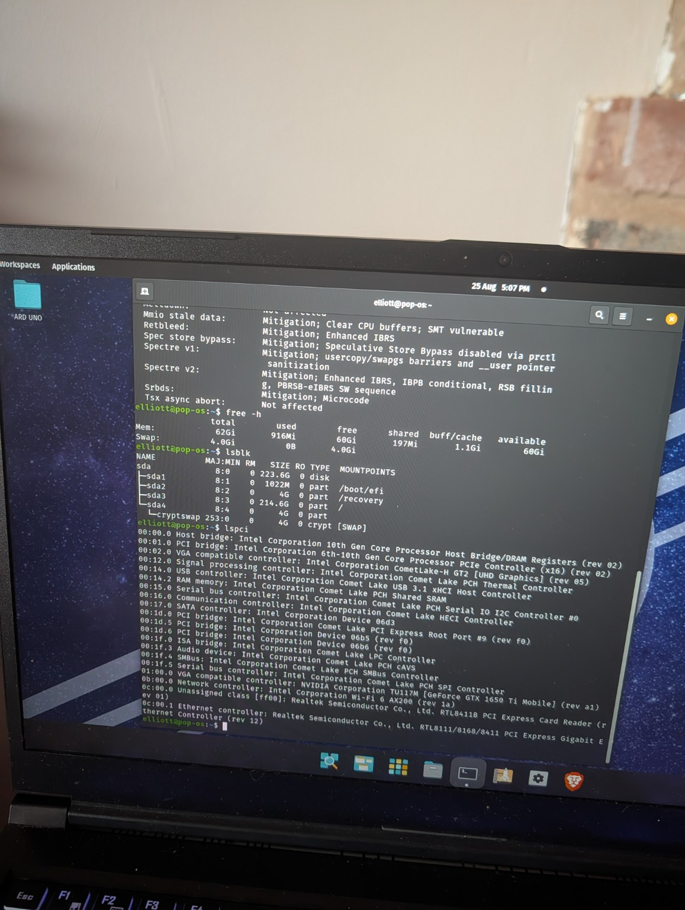
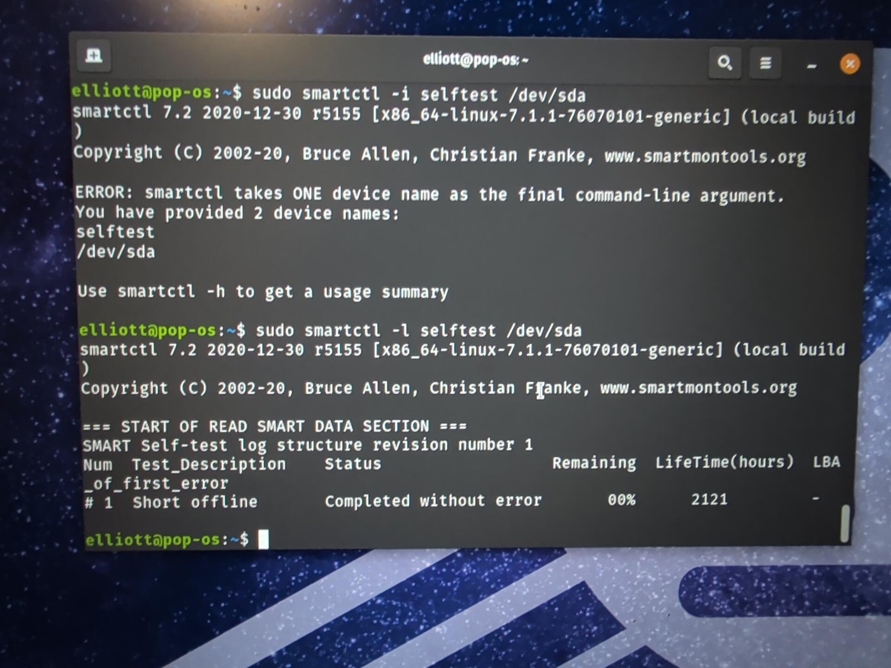

# Initial System Assessment

## Executive Summary

This assessment was performed as the first phase of a project to repurpose an older gaming laptop into a headless Linux homelab server.

The laptop initially failed to boot from local storage and instead attempted an EFI PXE network boot. A structured diagnostic process was used to determine the cause, beginning with firmware inspection and progressing to physical hardware inspection.

The investigation established that the laptop contained **no internal storage device**. A known-good Kingston 240 GB SATA SSD containing Pop!_OS was installed and successfully detected and booted, confirming that the SATA interface was functional.

The temporary Linux installation was subsequently used to validate the laptop's major hardware components and assess its suitability for continued use as a homelab server.

Testing included:

- CPU and hardware detection
- SATA storage functionality
- SSD SMART health
- SSD self-test
- Idle thermal monitoring
- Five-minute all-thread CPU stress testing
- RAM detection
- 50 GB memory integrity testing
- Battery health and AC/battery power transfer
- Wi-Fi connectivity
- Gigabit Ethernet connectivity
- DHCP and IP configuration
- Local and external network routing
- DNS resolution

No significant hardware fault was identified during the completed assessment.

## Final Assessment Status

| Component / Test | Result |
| --- | --- |
| Original boot failure diagnosis | **PASS — root cause identified** |
| SATA interface | **PASS** |
| Kingston 240 GB SSD detection | **PASS** |
| SSD SMART health | **PASS** |
| SSD short self-test | **PASS** |
| CPU detection | **PASS** |
| CPU stress/stability test | **PASS** |
| Thermal validation | **PASS** |
| RAM detection | **PASS** |
| 50 GB RAM integrity test | **PASS** |
| Battery condition | **PASS** |
| AC/battery power transfer | **PASS** |
| Wi-Fi | **PASS** |
| Gigabit Ethernet | **PASS — 1000 Mb/s full duplex** |
| Internet connectivity | **PASS** |
| DNS resolution | **PASS** |
| **Overall assessment** | **PASS** |

The laptop is therefore considered suitable to proceed to the **Linux server installation and configuration phase**.

---

# Stage 1 — Initial Power-On and Boot Failure

## Project Background

The objective of this project is to repurpose an old gaming laptop as a headless Linux homelab server.

When the laptop was last regularly used, the internal display was experiencing problems and was believed to be faulty. During the initial assessment, however, the internal display successfully produced a clear image without immediately obvious visual defects.

The display is not considered critical to the planned server deployment because the finished system will normally operate headlessly and be administered remotely across the local network.

The laptop's internal display and HDMI output will remain available as backup methods for direct troubleshooting if remote access is unavailable.

## Initial Power-On

The laptop successfully powered on during the initial assessment.

However, the system did not boot into an operating system. Instead, the firmware attempted an EFI PXE network boot over IPv6, which subsequently failed.



*Figure 1 — Initial boot attempt showing the system falling back to an EFI PXE network boot after failing to locate a usable local boot device.*

## Initial Diagnostic Assessment

The PXE boot attempt suggested that the firmware had failed to locate a usable local boot device before falling back to network boot.

Possible causes included:

- No operating system installed
- Missing or damaged bootloader
- Internal storage not detected
- Failed internal storage
- Internal storage previously removed

At this point, insufficient evidence was available to determine the root cause.

The next diagnostic step was therefore to inspect the BIOS/UEFI configuration and determine whether an internal storage device was detected.

---

# Stage 2 — BIOS and Storage Diagnostics

Following the initial PXE boot failure, BIOS/UEFI diagnostics were performed to determine whether the laptop could detect an internal storage device.

## Boot Device Check

After restarting the laptop, the system displayed a message indicating that the default boot device was missing or that the boot process had failed.

The Boot Option Menu was inspected and contained no available bootable devices.

This confirmed that the firmware could not locate a bootable device. However, this did not establish whether storage was physically absent, blank, disconnected, failed or otherwise undetected.

The BIOS/UEFI configuration was therefore inspected.

## BIOS/UEFI Inspection

The InsydeH2O BIOS Setup Utility was accessed using the `F2` key during startup.

The BIOS reported:

- CPU: Intel Core i7-10750H @ 2.60 GHz
- Installed memory: 65,536 MB (64 GB)
- SATA mode: AHCI

The Main section of the BIOS was inspected for detected storage devices.

The following SATA ports were reported:

- SATA Port 1: Not Present
- SATA Port 4: Not Present



*Figure 2 — BIOS/UEFI Main screen showing no storage devices detected on SATA Port 1 or SATA Port 4.*

The OffBoard SATA Controller Configuration and OffBoard NVMe Controller Configuration were also inspected.

No storage devices were reported in either configuration.

## Diagnostic Assessment

At this stage, the evidence established that:

- The laptop failed to boot from local storage.
- The firmware fell back to EFI PXE network boot.
- The PXE boot attempt failed.
- A "Default Boot Device Missing or Boot Failed" message was displayed.
- The Boot Option Menu contained no bootable devices.
- No SATA storage devices were detected.
- No NVMe storage devices were detected.

Two primary possibilities remained:

1. The laptop's previous internal storage had been physically removed.
2. Storage remained installed but was not being detected because of a connection, device or hardware fault.

Physical inspection was therefore required.

## Troubleshooting Path

The investigation deliberately progressed from the least invasive diagnostic steps toward physical inspection:

```text
PXE boot failure
        ↓
Check Boot Option Menu
        ↓
No bootable devices found
        ↓
Enter BIOS/UEFI
        ↓
Check SATA storage
        ↓
No SATA devices detected
        ↓
Check NVMe storage
        ↓
No NVMe devices detected
        ↓
Physical inspection required
```

---

# Stage 3 — Physical Hardware Inspection and Test Drive Verification

## Physical Inspection

The laptop was completely powered down and disconnected from external power and peripherals before the bottom cover was removed.

Visual inspection confirmed that **no internal storage device was installed**.

The inspection identified:

- Empty 2.5-inch SATA storage bay
- SATA data and power connection hardware present
- No installed M.2/NVMe SSD
- Two Corsair Vengeance DDR4 memory modules
- Dual cooling fans and heatpipe assembly
- No obvious signs of major physical damage
- Minor visible dust accumulation

The SATA connector and associated cabling showed no obvious signs of physical damage.



*Figure 3 — Internal view of the laptop showing the motherboard, cooling system, 64 GB DDR4 memory and empty internal storage locations.*

A closer inspection confirmed that the combined SATA data and power connector was present.



*Figure 4 — Close-up of the empty 2.5-inch SATA storage connection. The connector and cabling showed no obvious signs of physical damage.*

## Known-Good SATA SSD Test

Before purchasing replacement storage, a spare Kingston 240 GB 2.5-inch SATA SSD was used to test the laptop's storage interface.

The SSD was physically compatible with the laptop's SATA connection and contained an existing Pop!_OS Linux installation.

After installation, the laptop initially displayed a boot failure before subsequently locating the drive and successfully booting into Pop!_OS.

This demonstrated that the laptop could:

- Detect the SATA SSD
- Read data from the drive
- Load an existing bootloader
- Start a Linux operating system
- Reach a functioning desktop environment

This provided strong evidence that the original boot failure resulted from **the absence of internal storage**, rather than failure of the SATA controller or motherboard.

---

## Linux Hardware Verification

The existing Pop!_OS installation was used as a temporary diagnostic environment.

### CPU Verification

The following command was used:

```bash
lscpu
```

The system reported:

- Architecture: x86_64
- CPU: Intel Core i7-10750H @ 2.60 GHz
- 6 physical CPU cores
- 12 logical processors
- Intel VT-x virtualisation support

VT-x support is particularly useful for the planned homelab because the server can later be used to host virtual machines.



*Figure 5 — Linux `lscpu` output confirming the Intel Core i7-10750H, 6-core/12-thread configuration and VT-x virtualisation support.*

### Memory Verification

The following command was used:

```bash
free -h
```

Approximately 62 GiB of usable system memory was detected.

This is consistent with the 64 GB of installed DDR4 memory identified during the physical inspection and BIOS assessment.

### Storage Verification

The following command was used:

```bash
lsblk
```

The Kingston SSD was detected as:

- Device: `sda`
- Usable capacity: approximately 223.6 GiB

The drive contained an existing Pop!_OS installation with EFI, recovery, root and encrypted swap partitions.

This further confirmed that the SATA storage connection was functioning correctly.

### PCI Hardware Verification

The following command was used:

```bash
lspci
```

Linux successfully enumerated major system devices including:

- Intel chipset and PCI controllers
- Intel Wi-Fi 6 AX200 wireless adapter
- Realtek PCIe Gigabit Ethernet controller
- NVIDIA GeForce GTX 1650 Ti Mobile GPU
- USB controllers
- Audio devices
- Other PCI-connected hardware



*Figure 6 — Linux hardware verification showing memory, storage and PCI device detection using `free -h`, `lsblk` and `lspci`.*

## Stage 3 Conclusion

Stage 3 established that:

- The laptop originally contained no internal storage device.
- The SATA storage bay and connector were present.
- The SATA interface successfully detected and booted from a known-good SSD.
- The motherboard, CPU and memory were capable of running Linux.
- Approximately 64 GB of RAM was available.
- The Intel Core i7-10750H provided 6 cores and 12 threads.
- Intel VT-x virtualisation support was available.
- Gigabit Ethernet and Wi-Fi hardware were detected.
- The NVIDIA GPU was detected.
- No major hardware fault was identified.

The original EFI PXE boot failure could therefore be explained by the absence of an installed local storage device.

---

# Stage 4 — Operating System Update and SSD Health Validation

Following successful installation and boot of the temporary Kingston 240 GB SATA SSD, further checks were performed before proceeding with more intensive system testing.

## Operating System Update

The existing Pop!_OS installation had not been used or updated for approximately one year.

During the package upgrade process, `dpkg` reported errors involving:

- `system76-dkms`
- `system76-acpi-dkms`

The incomplete package configuration was investigated using:

```bash
sudo dpkg --configure -a
```

The output indicated that the System76 DKMS modules encountered errors while attempting to build against an installed Linux kernel.

DKMS (Dynamic Kernel Module Support) automatically rebuilds third-party kernel modules when kernels are installed or updated.

The currently running kernel was checked using:

```bash
uname -r
```

Before rebooting:

```text
6.0.2-76060002-generic
```

The software update had installed a newer kernel, but the operating system was still running the kernel already loaded into memory.

After rebooting, `uname -r` returned:

```text
7.1.1-76070101-generic
```

This confirmed successful boot into the newly installed Linux kernel.

The earlier System76 DKMS package errors were retained in the project record rather than considered resolved solely because the newer kernel booted successfully.

---

## SSD SMART Health Assessment

The `smartmontools` package was installed:

```bash
sudo apt install smartmontools
```

SMART information for the SSD was retrieved using:

```bash
sudo smartctl -a /dev/sda
```

The overall SMART health assessment reported:

```text
PASSED
```

Additional SMART attributes were reviewed rather than relying exclusively on the overall health indicator.

### SMART Results

The notable results were:

- Overall SMART health: **PASSED**
- Power-on time: approximately **2,121 hours**
- Power cycle count: approximately **2,279**
- Operating temperature: approximately **32°C**
- Reported uncorrectable errors: **0**
- Reallocated events observed: **0**
- SATA physical/communication errors observed: **0**
- SSD life indicator: approximately **96%**
- SMART error log: **No Errors Logged**
- Unsafe shutdown count: **17**

The historical unsafe shutdown count was noted. However, the remaining SMART information did not indicate an active storage fault.

---

## SMART Short Self-Test

The SSD's built-in short diagnostic was started using:

```bash
sudo smartctl -t short /dev/sda
```

After the required test period, the self-test log was retrieved:

```bash
sudo smartctl -l selftest /dev/sda
```

Result:

```text
# 1  Short offline  Completed without error  00%  2121  -
```

The `00%` value represents the percentage of the test remaining, indicating that the diagnostic completed fully.

The key result was:

```text
Completed without error
```



*Figure 7 — SMART short self-test result for the temporary Kingston 240 GB SATA SSD, confirming that the diagnostic completed without error.*

## Stage 4 Conclusion

The Kingston 240 GB SATA SSD successfully passed both the SMART health assessment and its built-in short self-test.

No significant evidence of an active SSD fault was identified.

The SSD was therefore considered suitable for the initial homelab deployment.

Its primary limitation is capacity rather than current health. Additional storage may eventually be required as the environment expands to include virtual machines, containers, snapshots, backups and other services.

---

# Stage 5 — System Stability and Hardware Validation

Stage 5 tested whether the laptop could operate reliably under load and whether its thermal, memory, power and networking subsystems were suitable for homelab use.

---

## Idle Thermal Assessment

Hardware temperature sensors were inspected using:

```bash
sensors
```

Approximate idle readings were:

- CPU package: 33°C
- CPU cores: 32–33°C
- Memory modules: 29–30°C
- Wi-Fi adapter: 30°C
- Platform Controller Hub (PCH): 41°C
- ACPI thermal zone: 34°C

The CPU reported a critical temperature threshold of 100°C.

Some memory sensor entries displayed 0°C alarm thresholds. These were inconsistent with the actual measured temperatures and were treated as malformed or unavailable threshold data rather than evidence of a thermal problem.

**Result: PASS — no thermal concern identified at idle.**


*Figure 8 — Idle hardware temperature readings collected before controlled load testing.*

---

## Controlled CPU Stress and Stability Test

The availability of `stress-ng` was checked using:

```bash
command -v stress-ng
```

As it was not installed, it was added using:

```bash
sudo apt install stress-ng
```

A five-minute CPU stress test was then performed:

```bash
stress-ng --cpu 0 --timeout 5m --metrics-brief
```

Options:

- `--cpu 0` — use all available logical CPUs
- `--timeout 5m` — stop automatically after five minutes
- `--metrics-brief` — provide a summary on completion

The Intel Core i7-10750H contains six physical cores and twelve logical processors through Hyper-Threading.

`stress-ng` therefore dispatched twelve CPU workers.

Temperatures were monitored separately using:

```bash
watch -n 2 sensors
```

The stress test completed its full five-minute duration successfully.

The observed CPU temperature peaked at approximately **82°C**, remaining below the reported **100°C critical threshold**.

No crash, freeze, unexpected shutdown or other visible instability occurred.

**Result: PASS — five-minute all-thread CPU stress test completed without reproduced instability or excessive observed temperature.**


*Figure 9 — Successful completion of the five-minute `stress-ng` CPU stability test.*

---

## Memory Detection

Memory availability was checked using:

```bash
free -h
```

The system reported:

```text
              total    used    free    shared    buff/cache    available
Mem:           62Gi    3.5Gi    56Gi     197Mi       2.8Gi         55Gi
Swap:          19Gi       0B    19Gi
```

This confirmed approximately:

- Total usable memory: 62 GiB
- Used: 3.5 GiB
- Free: 56 GiB
- Available: 55 GiB
- Swap: 19 GiB

The approximately 62 GiB of usable memory is consistent with 64 GB of physically installed RAM after accounting for measurement differences and system-reserved memory.

**Result: PASS**

---

## Memory Integrity Test

Because correct memory detection does not establish memory reliability, a dedicated integrity test was performed.

`memtester` was installed using:

```bash
sudo apt install memtester
```

A 50 GB test was then performed:

```bash
sudo memtester 50G 1
```

The utility successfully allocated and locked:

```text
51200MB
53687091200 bytes
```

One complete test loop was performed.

Test patterns included:

- Stuck Address
- Random Value
- Compare XOR
- Compare SUB
- Compare MUL
- Compare DIV
- Compare OR
- Compare AND
- Sequential Increment
- Solid Bits
- Block Sequential
- Checkerboard
- Bit Spread
- Bit Flip
- Walking Ones
- Walking Zeroes
- 8-bit Writes
- 16-bit Writes

Every displayed test completed with an `ok` result.

The utility subsequently reported:

```text
Done.
```

No memory errors, crashes, freezes or other visible instability occurred.

Because `memtester` operates from within a running operating system, it cannot test literally every physical memory address. However, successfully exercising 50 GB provides substantial evidence of memory stability for the purposes of this assessment.

**Result: PASS — 50 GB completed one full `memtester` integrity test without detected errors.**

---

# Battery and Power Validation

Although the server is expected to operate primarily from AC power, the internal battery can provide useful short-duration backup power during a mains interruption.

Battery health and AC/battery transfer behaviour were therefore assessed.

## Battery Capacity and Telemetry

Linux exposed the battery at:

```text
/sys/class/power_supply/BAT0/
```

The following interfaces were inspected:

```bash
cat /sys/class/power_supply/BAT0/charge_full
cat /sys/class/power_supply/BAT0/charge_full_design
cat /sys/class/power_supply/BAT0/status
cat /sys/class/power_supply/BAT0/capacity
cat /sys/class/power_supply/BAT0/cycle_count
cat /sys/class/power_supply/BAT0/voltage_now
```

Reported values:

- `charge_full`: 3,099,000
- `charge_full_design`: 3,175,000
- `status`: Full
- `capacity`: 100%
- `cycle_count`: 0
- `voltage_now`: 17,012,000 microvolts

Comparing full-charge capacity with design capacity produced an estimated capacity retention of approximately **97.6%**, corresponding to approximately **2.4% reported capacity loss**.

The reported voltage corresponds to approximately **17.01 V**.

The reported cycle count of `0` was not interpreted as proof that the battery had never been cycled because the hardware may not expose meaningful cycle-count data through this Linux interface.

## Physical Battery Inspection

No visible swelling, deformation, leakage or other obvious physical damage was observed during the earlier internal inspection.

**Physical battery condition: PASS**

## AC/Battery Transfer Test

AC power state was checked using:

```bash
cat /sys/class/power_supply/AC/online
```

With AC connected:

```text
1
```

The charger was disconnected while the laptop remained powered on and idle.

The system continued operating normally.

AC status changed to:

```text
0
```

Battery status changed to:

```text
Discharging
```

During the short test, reported battery capacity decreased from 100% to approximately 96%.

After reconnecting the charger, AC status returned to:

```text
1
```

Battery status changed to:

```text
Charging
```

No crash, freeze or unexpected shutdown occurred during either transition.

**AC-loss and battery-transfer test: PASS**

## Charge-Limit Investigation

Charge-control threshold support was investigated using:

```bash
ls /sys/class/power_supply/BAT0/ | grep threshold
```

No output was returned.

Standard Linux charge-control threshold files were therefore not exposed through the current BAT0 interface.

This does not establish that charge limiting is impossible on this hardware. The feature can be investigated again after deployment of the final server operating system.

## Battery Assessment

The battery:

- Reports approximately 97.6% of original design capacity
- Shows no obvious physical damage
- Successfully powers the laptop following AC disconnection
- Returns to charging after AC restoration
- Causes no instability during power transitions

The internal battery will therefore be retained in the server build.

It is not a replacement for a managed UPS, but it provides useful short-duration backup power and could later be combined with monitoring and automated graceful-shutdown functionality.

**Battery and power validation: PASS**

---

# Network Validation

Both wireless and wired networking were tested before closing the hardware assessment.

---

## Wi-Fi Validation

The laptop's Intel Wi-Fi adapter was tested for interface detection, DHCP configuration, routing, Internet connectivity and DNS resolution.

### Interface and Address Configuration

The wireless interface was identified as:

```text
wlp11s0
```

The interface reported `UP` and `LOWER_UP`.

IPv4 configuration:

```text
192.168.1.230/24
```

Address assignment:

```text
Dynamic / DHCP
```

Default gateway:

```text
192.168.1.1
```

### Gateway Connectivity

Command:

```bash
ping -c 4 192.168.1.1
```

Results:

- 4 packets transmitted
- 4 packets received
- 0% packet loss
- Average RTT: approximately **4.27 ms**

### External IPv4 Connectivity

Command:

```bash
ping -c 4 8.8.8.8
```

Results:

- 4 packets transmitted
- 4 packets received
- 0% packet loss
- Average RTT: approximately **14.04 ms**

Successful communication with a numerical external address demonstrated Internet connectivity independently of DNS.

### DNS and Hostname Connectivity

Command:

```bash
ping -c 4 google.com
```

The hostname successfully resolved to:

```text
142.251.30.101
```

Results:

- 4 packets transmitted
- 4 packets received
- 0% packet loss
- Average RTT: approximately **14.33 ms**

This confirmed functioning DNS resolution and external hostname connectivity.

### Wi-Fi Result

| Test | Result |
| --- | --- |
| Wireless interface detected | **PASS** |
| Interface operational | **PASS** |
| IPv4/DHCP configuration | **PASS** |
| Default route | **PASS** |
| Local gateway connectivity | **PASS** |
| External IPv4 connectivity | **PASS** |
| DNS resolution | **PASS** |
| Packet loss | **0%** |

**Overall Wi-Fi Result: PASS**

---

# Ethernet Validation

Wired Ethernet validation was performed using the laptop's Realtek Gigabit Ethernet interface.

## Physical Link

Command:

```bash
ip link show enp12s0f1
```

Output:

```text
2: enp12s0f1: <BROADCAST,MULTICAST,UP,LOWER_UP> mtu 1500 qdisc fq_codel state UP mode DEFAULT group default qlen 1000
    link/ether 80:fa:5b:89:95:e5 brd ff:ff:ff:ff:ff:ff
```

Key findings:

- Interface: `enp12s0f1`
- Interface state: `UP`
- Physical carrier: `LOWER_UP`

`UP` confirms that the interface was enabled, while `LOWER_UP` confirms physical link detection.

**Result: PASS**

---

## Link Speed and Duplex

Command:

```bash
ethtool enp12s0f1
```

Relevant output:

```text
Speed: 1000Mb/s
Duplex: Full
Auto-negotiation: on
Link detected: yes
```

The Ethernet interface successfully negotiated a **1000 Mb/s full-duplex** connection.

A `netlink error: Operation not permitted` message was also displayed while running `ethtool`. This did not prevent retrieval of the required link information and did not indicate failure of the Ethernet connection.

**Result: PASS**

---

## DHCP and IPv4 Configuration

Command:

```bash
ip addr show enp12s0f1
```

Relevant output:

```text
inet 192.168.1.209/24 brd 192.168.1.255 scope global dynamic noprefixroute enp12s0f1
```

Key findings:

- IPv4 address: `192.168.1.209/24`
- Address assignment: Dynamic/DHCP
- Interface: `enp12s0f1`

**Result: PASS**

---

## Routing

Command:

```bash
ip route
```

Output:

```text
default via 192.168.1.1 dev enp12s0f1 proto dhcp metric 100
169.254.0.0/16 dev enp12s0f1 scope link metric 1000
192.168.1.0/24 dev enp12s0f1 proto kernel scope link src 192.168.1.209 metric 100
```

Key findings:

- Default gateway: `192.168.1.1`
- Default interface: `enp12s0f1`
- Local subnet: `192.168.1.0/24`
- Source address: `192.168.1.209`

The system had a valid default route through the wired Ethernet interface.

**Result: PASS**

---

## Local Gateway Connectivity

Command:

```bash
ping -c 4 192.168.1.1
```

Output:

```text
PING 192.168.1.1 (192.168.1.1) 56(84) bytes of data.
64 bytes from 192.168.1.1: icmp_seq=1 ttl=64 time=0.581 ms
64 bytes from 192.168.1.1: icmp_seq=2 ttl=64 time=0.588 ms
64 bytes from 192.168.1.1: icmp_seq=3 ttl=64 time=0.640 ms
64 bytes from 192.168.1.1: icmp_seq=4 ttl=64 time=0.651 ms

--- 192.168.1.1 ping statistics ---
4 packets transmitted, 4 received, 0% packet loss, time 3111ms
rtt min/avg/max/mdev = 0.581/0.615/0.651/0.030 ms
```

Results:

- 4/4 packets received
- Packet loss: **0%**
- Average RTT: **0.615 ms**

**Result: PASS**

---

## External IPv4 Connectivity

Command:

```bash
ping -c 4 8.8.8.8
```

Output:

```text
PING 8.8.8.8 (8.8.8.8) 56(84) bytes of data.
64 bytes from 8.8.8.8: icmp_seq=1 ttl=115 time=11.4 ms
64 bytes from 8.8.8.8: icmp_seq=2 ttl=115 time=10.8 ms
64 bytes from 8.8.8.8: icmp_seq=3 ttl=115 time=10.0 ms
64 bytes from 8.8.8.8: icmp_seq=4 ttl=115 time=9.36 ms

--- 8.8.8.8 ping statistics ---
4 packets transmitted, 4 received, 0% packet loss, time 3004ms
rtt min/avg/max/mdev = 9.360/10.386/11.366/0.760 ms
```

Results:

- 4/4 packets received
- Packet loss: **0%**
- Average RTT: **10.386 ms**

This confirmed external IPv4 connectivity independently of DNS.

**Result: PASS**

---

## DNS and Hostname Connectivity

Command:

```bash
ping -c 4 google.com
```

Output:

```text
PING google.com (142.250.129.102) 56(84) bytes of data.
64 bytes from lclhrb-in-f102.1e100.net (142.250.129.102): icmp_seq=1 ttl=112 time=9.48 ms
64 bytes from lclhrb-in-f102.1e100.net (142.250.129.102): icmp_seq=2 ttl=112 time=12.8 ms
64 bytes from lclhrb-in-f102.1e100.net (142.250.129.102): icmp_seq=3 ttl=112 time=9.04 ms
64 bytes from lclhrb-in-f102.1e100.net (142.250.129.102): icmp_seq=4 ttl=112 time=12.0 ms

--- google.com ping statistics ---
4 packets transmitted, 4 received, 0% packet loss, time 3003ms
rtt min/avg/max/mdev = 9.044/10.836/12.786/1.606 ms
```

The hostname successfully resolved to:

```text
142.250.129.102
```

Results:

- 4/4 packets received
- Packet loss: **0%**
- Average RTT: **10.836 ms**

This confirmed functioning DNS resolution and external hostname connectivity over Ethernet.

**Result: PASS**

---

## Ethernet Validation Summary

| Test | Result |
| --- | --- |
| Interface detected | **PASS** |
| Physical link | **PASS** |
| Negotiated speed | **PASS — 1000 Mb/s** |
| Duplex | **PASS — Full** |
| Auto-negotiation | **PASS** |
| DHCP/IPv4 configuration | **PASS** |
| Default route | **PASS** |
| Gateway connectivity | **PASS — 0% loss** |
| External IPv4 connectivity | **PASS — 0% loss** |
| DNS resolution | **PASS** |

**Overall Ethernet Result: PASS**

---

# Stage 5 Conclusion

Stage 5 successfully validated the laptop's stability, thermals, memory, battery/power behaviour and network interfaces.

The completed testing demonstrated:

- Normal idle operating temperatures
- Stable operation under full CPU load
- CPU peak temperature of approximately 82°C during the five-minute stress test
- Correct detection of 64 GB installed RAM
- Successful 50 GB memory integrity test
- No detected memory errors
- Healthy reported battery capacity
- Successful AC-to-battery and battery-to-AC power transfer
- Functional Wi-Fi networking
- Functional Gigabit Ethernet at 1000 Mb/s full duplex
- Successful DHCP configuration
- Successful local network connectivity
- Successful Internet connectivity
- Successful DNS resolution
- No crashes, freezes or unexpected shutdowns during the completed tests

**Stage 5 Result: PASS**

---

# Final Assessment Conclusion

The initial system assessment is now complete.

The investigation began with a laptop that could not locate a bootable local device and fell back to an EFI PXE network boot.

Through BIOS inspection and physical hardware inspection, it was established that the laptop contained **no internal storage device**.

Installation of a known-good Kingston 240 GB SATA SSD demonstrated that the laptop's SATA interface was functional and allowed the machine to boot successfully into Linux.

Subsequent testing validated the major hardware required for the planned homelab deployment:

- Intel Core i7-10750H — 6 cores / 12 threads
- Intel VT-x virtualisation support
- 64 GB DDR4 RAM
- Kingston 240 GB SATA SSD
- Intel Wi-Fi 6 AX200
- Realtek Gigabit Ethernet
- NVIDIA GeForce GTX 1650 Ti Mobile
- Functional internal battery
- Functional cooling system

The SSD passed its SMART assessment and short self-test. The CPU completed sustained all-thread stress testing without instability. A 50 GB memory integrity test completed without detected errors. Battery power transfer operated correctly. Both Wi-Fi and wired Ethernet successfully demonstrated local network, Internet and DNS connectivity.

No significant hardware fault was identified during the completed assessment.

This does not guarantee that every component is fault-free or that no future hardware failure will occur. However, the completed diagnostic evidence is sufficient to proceed with the intended homelab deployment.

## Final Result

> **INITIAL SYSTEM ASSESSMENT: PASS**

The laptop is considered suitable to proceed to the next phase of the project.

## Next Phase

**Linux Server Installation and Initial Configuration**

The next phase will replace the temporary diagnostic environment with the server operating system and begin configuration of the laptop for headless operation, remote administration and future homelab services.
